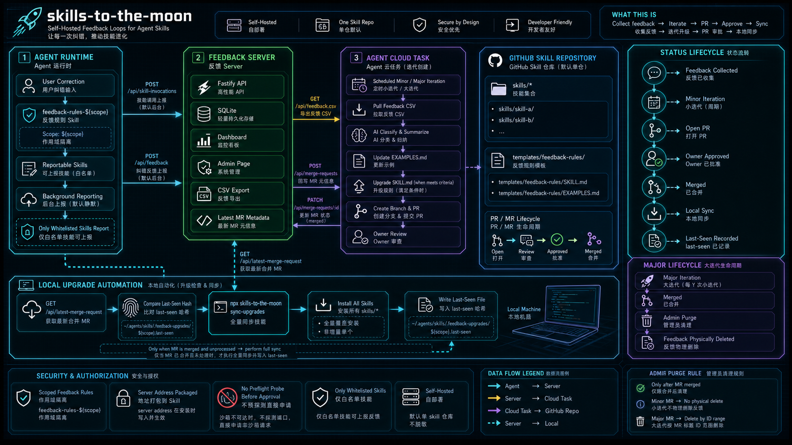

# skills-to-the-moon

[English](README.md)

面向 Agent skills 的自部署反馈闭环：上报纠错、监控调用、创建升级 PR，并在本地同步 skill。

`skills-to-the-moon` 帮助团队把日常 Agent 出错和被纠正的瞬间，转化成经过审查的 skill 改进。它会记录 skill 调用和纠错反馈，保留可追踪证据，让定时 Agent 通过 PR 提议升级，并为本地机器提供一条可重复执行的已合并 skill 同步路径。

项目开放建设，面向那些希望把真实 Agent 纠错沉淀为共享 skill 升级的团队。真实边界、异常案例和聚焦补丁会让这个闭环更锋利。



## 目录

- [为什么存在](#为什么存在)
- [工作方式](#工作方式)
- [你会得到什么](#你会得到什么)
- [快速开始](#快速开始)
- [自动化模板](#自动化模板)
- [运行反馈闭环](#运行反馈闭环)
- [API](#api)
- [项目结构](#项目结构)
- [开发](#开发)
- [发布到 npm](#发布到-npm)
- [Roadmap](#roadmap)
- [贡献](#贡献)
- [安全](#安全)

## 为什么存在

当纠错被保留、审查，并转换成示例或稳定规则时，Agent skills 才会真正变好。这个项目让这条闭环保持显式：

- 在后台收集反馈，不打断用户
- 把每次纠错追踪到 skill 名称、工作目录、技术栈、AI 输出和用户纠错输入
- 通过 PR 升级 skill，而不是静默修改
- 让 skill 仓库 owner 审批哪些内容能成为长期行为
- 使用记录过的 `last-seen` hash 在本地同步已合并的 skill 更新

## 工作方式

1. **运行时上报**：带 scope 的 `feedback-rules-${scope}` skill 判断一次真实业务 skill 调用或纠错是否需要上报。
2. **Feedback server**：Fastify 接收事件，写入 SQLite，渲染 dashboard，导出 CSV，并追踪最新升级 PR。
3. **迭代 Agent**：定时云端 Agent 读取反馈 CSV，归纳示例，更新 `EXAMPLES.md` 或 `SKILL.md`，创建 PR，并记录 PR 元信息。
4. **Owner 审查**：skill 仓库 owner 审查并合并 PR。
5. **本地同步**：本地自动化检查 `/api/latest-merge-request`，对比 `head_commit_hash` 和 `.feedback-upgrades/<scope>.last-seen`，安装仓库内全部 skills，并且只在同步成功后记录 hash。

## 你会得到什么

- 带 scope 的 feedback rules，并且 server address 会被打包进去。
- 后台 skill 调用上报和纠错上报。
- 一个自部署的 Fastify + SQLite feedback server。
- Dashboard、admin 页面、CSV 导出、最新 PR 元信息，以及已合并 PR 的清理控制。
- 用于定时迭代 Agent 和本地升级检查 Agent 的 prompt 模板。
- 用于安装 feedback rules 和同步已合并 skill 升级的 `npx` 命令。

## 快速开始

### 启动 feedback server

```bash
pnpm install
pnpm run build

SKILLS_FEEDBACK_DB=./data/skills-feedback.sqlite \
SKILLS_FEEDBACK_ADMIN_TOKEN=change-me \
HOST=127.0.0.1 \
PORT=4321 \
pnpm start
```

打开：

```text
http://127.0.0.1:4321/
http://127.0.0.1:4321/admin
```

开发模式：

```bash
SKILLS_FEEDBACK_DB=./data/skills-feedback.sqlite \
SKILLS_FEEDBACK_ADMIN_TOKEN=change-me \
HOST=127.0.0.1 \
PORT=4321 \
pnpm run dev
```

server 可以跑在你的机器上，也可以跑在团队 dev server 上。把 Agent 实际能够请求的地址打包进 feedback rules skill。

### 安装 scoped feedback rules

```bash
npx --yes --registry=https://registry.npmjs.org/ skills-to-the-moon install-feedback-rules \
  --scope github-smoke \
  --server-address http://127.0.0.1:4321 \
  --skills github-smoke-canary
```

本地开发时：

```bash
node bin/skills-to-the-moon.mjs install-feedback-rules \
  --scope github-smoke \
  --server-address http://127.0.0.1:4321 \
  --skills github-smoke-canary
```

这个命令会：

- 把 `feedback-rules-${scope}` 安装到 `~/.agents/skills`
- 向 `~/.codex/AGENTS.md` 追加 Feedback 上报预授权块
- 记录已授权的 scope、server address 和可上报 skills
- 告诉 Agent：在请求已授权的非沙箱 feedback 上报前，不要先探测 server

### 同步已合并的 skill 升级

```bash
npx --yes --registry=https://registry.npmjs.org/ skills-to-the-moon sync-upgrades \
  --scope github-smoke \
  --server-address http://127.0.0.1:4321 \
  --repo Ryan2128/skills-to-the-moon \
  --ref main
```

本地开发时：

```bash
node bin/skills-to-the-moon.mjs sync-upgrades \
  --scope github-smoke \
  --server-address http://127.0.0.1:4321 \
  --source-dir /path/to/skills-to-the-moon
```

同步规则：

- 读取 `GET /api/latest-merge-request`
- 如果最新 `head_commit_hash` 已经记录过，则跳过
- 如果 PR 尚未合并，则拒绝同步
- 安装 `skills/*` 下的每一个 skill
- 同步成功后写入 `~/.agents/skills/.feedback-upgrades/<scope>.last-seen`

## 自动化模板

### 迭代 Agent

使用 [`docs/automation-templates/iteration-agent-prompt.md`](docs/automation-templates/iteration-agent-prompt.md)。

这个定时 Agent 会拉取反馈 CSV，判断当前周期是小迭代还是大迭代，更新示例或稳定 skill 规则，创建 PR，并把元信息回写到 feedback server。

### 本地升级检查 Agent

使用 [`docs/automation-templates/local-upgrade-check-agent-prompt.md`](docs/automation-templates/local-upgrade-check-agent-prompt.md)。

这个本地 Agent 会检查最新 PR 元信息，对比本地保存的 `last-seen` hash，对已合并升级执行 `sync-upgrades`，并且永远不会在同步成功前写入 `last-seen`。

## 运行反馈闭环

### 合并后清理

owner 合并升级 PR 后，在 `/admin` 执行清理。

- 只有已合并 PR 可以清理。
- PR 标题应记录覆盖的 feedback ID 范围。
- 小迭代 PR 可以保留源反馈，供后续复查。
- 大迭代 PR 合并后，可以物理删除覆盖范围内的反馈。

### 多个 feedback 服务

每个 feedback 服务安装一个 `feedback-rules-${scope}` 包。每个包都带有自己的 scope、server address 和可上报 skill 列表，因此只有匹配该 skill scope 的纠错才会上报到对应服务。

MVP 默认每个部署服务一个 skill 仓库。不同 feedback 工具需要隔离时，使用不同 scope 或不同部署。

## API

```text
POST  /api/skill-invocations
POST  /api/feedback
GET   /api/feedback.csv?from=YYYY-MM-DD&to=YYYY-MM-DD
GET   /api/latest-merge-request
POST  /api/merge-requests
PATCH /api/merge-requests/:id/status
POST  /api/admin/merge-requests/:id/purge
```

API 说明：

- `POST /api/merge-requests` 要求标题类似 `[skills-feedback][minor][feedback:1-10] ...` 或 `[skills-feedback][major][feedback:1-10] ...`。
- `status: "merged"` 必须带 `merged_at`；非 merged 状态不能设置 `merged_at`。
- `POST /api/admin/merge-requests/:id/purge` 需要配置 `SKILLS_FEEDBACK_ADMIN_TOKEN`，并支持通过 `x-admin-token`、表单 body 的 `admin_token` 或 query 的 `admin_token` 传入。
- purge 只允许作用于已合并的 `major` PR，并会记录 purge audit。

## 项目结构

```text
bin/                         CLI 入口
src/server/                  Fastify server、SQLite repositories、web pages
templates/feedback-rules/    动态 feedback-rules-${scope} 模板
skills/                      由该仓库管理的常规 skills
docs/automation-templates/   Agent prompt 模板
docs/superpowers/            设计和实现记录
tests/                       API、domain、CLI、web 和 skill tests
```

## 开发

```bash
pnpm install
pnpm test
pnpm run typecheck
pnpm run build
pnpm run validate:feedback-skill
```

## 发布到 npm

发布前：

```bash
pnpm test
pnpm run typecheck
pnpm run build
pnpm run validate:feedback-skill
npm pack --dry-run
```

确认 tarball 包含 `bin/`、`scripts/`、`templates/`、`skills/`、`docs/`、`dist/`、`README.md`、`README.zh-CN.md` 和 `LICENSE`。

发布：

```bash
npm login --registry=https://registry.npmjs.org/
npm publish --registry=https://registry.npmjs.org/
```

版本更新：

```bash
npm version patch
npm publish --registry=https://registry.npmjs.org/
git push --follow-tags
```

npm 参考：

- [Creating and publishing unscoped public packages](https://docs.npmjs.com/creating-and-publishing-unscoped-public-packages/)
- [`npm publish`](https://docs.npmjs.com/cli/v10/commands/npm-publish/)
- [`package.json` `bin`](https://docs.npmjs.com/cli/v10/configuring-npm/package-json/#bin)

## Roadmap

当前是 MVP。server、scoped feedback rules、上报接口、dashboard、PR 元信息、已合并 PR 的 admin 控制，以及本地同步命令都已经就位。

后续路径：

- **主动更新 skill**：从被动 `sync-upgrades` 检查继续向主动更新流程演进，能够检测已合并 skill 升级、执行正确安装器、记录 `last-seen`，并在同步失败时给出清晰恢复步骤。
- **适配更多 Agent**：支持更多 Agent 运行时、全局指令文件、skill 安装位置、沙箱审批模型和上报 hooks，同时不改变核心 feedback server。
- **发布自动化和 provenance**：让 npm 发布、包校验和 provenance 检查可重复执行。
- **真实反馈示例**：从真实纠错闭环中沉淀更多示例，让 skill 升级保持接地。

## 贡献

最有价值的贡献通常来自真实反馈闭环。

好的补丁通常包括：

- 新的 skill 纠错示例
- 不同 Agent 环境下的安装和预授权修复
- 自部署 feedback server 的部署脚本
- 迭代、审查、同步和清理流程的改进

提交 PR 前：

```bash
pnpm test
pnpm run typecheck
pnpm run build
```

一份有帮助的 PR 会说明改了什么、为什么改、如何验证，以及是否影响 feedback payload、数据库 schema、全局 `AGENTS.md` 或 skill 安装路径。

## 安全

这个工具面向自部署场景。默认不会对反馈内容做脱敏。

避免把 demo server 暴露给不可信网络。不要在 feedback payload 中包含密钥、凭证、环境变量、浏览器数据或无关文件内容。

## License

MIT
